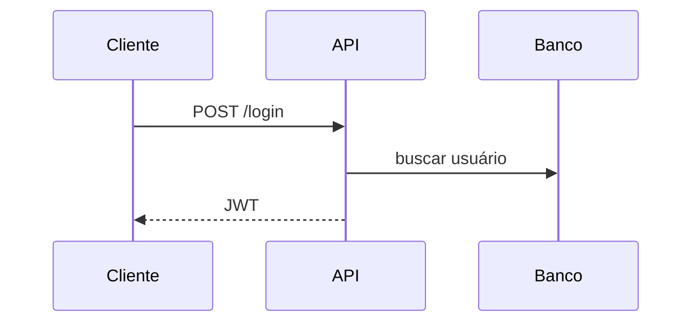

# MkDocs: Portais de Documentação com Material for MkDocs

MkDocs é uma ferramenta simples e poderosa para criar documentação estática em Markdown. É excelente para portais de projeto, documentação de produto, guias internos, manuais de APIs, runbooks e conteúdos técnicos organizados.

Com Material for MkDocs, é possível criar uma documentação moderna, navegável e pesquisável rapidamente.

---

## Instalação

```bash
pip install mkdocs mkdocs-material
```

Criar projeto:

```bash
mkdocs new docs-site
cd docs-site
```

Estrutura:

```text
docs-site/
├── docs/
│   └── index.md
└── mkdocs.yml
```

Servidor local:

```bash
mkdocs serve
```

Build:

```bash
mkdocs build
```

---

## mkdocs.yml Básico

```yaml
site_name: Minha Documentação
theme:
  name: material

nav:
  - Início: index.md
  - Instalação: instalacao.md
  - Uso: uso.md
```

---

## Estrutura Recomendada

```text
docs/
├── index.md
├── getting-started.md
├── guides/
│   ├── deploy.md
│   └── tests.md
├── reference/
│   ├── settings.md
│   └── api.md
├── architecture/
│   ├── overview.md
│   └── adr/
└── troubleshooting.md
```

---

## Material for MkDocs

```yaml
theme:
  name: material
  language: pt-BR
  features:
    - navigation.tabs
    - navigation.sections
    - navigation.top
    - search.highlight
    - content.code.copy
```

Paleta:

```yaml
theme:
  name: material
  palette:
    - scheme: default
      primary: blue
      accent: indigo
```

---

## Blocos de Código

Markdown:

````markdown
```python
def somar(a: int, b: int) -> int:
    return a + b
```
````

Material permite botão de copiar com `content.code.copy`.

---

## Admonitions

```bash
pip install pymdown-extensions
```

`mkdocs.yml`:

```yaml
markdown_extensions:
  - admonition
  - pymdownx.details
  - pymdownx.superfences
```

Uso:

```markdown
!!! warning "Atenção"
    Não coloque segredos no repositório.
```

---

## Mermaid

Diagramas:

```yaml
markdown_extensions:
  - pymdownx.superfences:
      custom_fences:
        - name: mermaid
          class: mermaid
          format: !!python/name:pymdownx.superfences.fence_code_format
```

Markdown:

````markdown

````

---

## mkdocstrings para API Python

```bash
pip install mkdocstrings[python]
```

`mkdocs.yml`:

```yaml
plugins:
  - search
  - mkdocstrings:
      handlers:
        python:
          options:
            docstring_style: google
            show_source: true
```

Página:

```markdown
# API Reference

::: app.services.pedidos
```

Isso aproxima MkDocs do Sphinx para documentação de código.

---

## Deploy no GitHub Pages

```bash
mkdocs gh-deploy
```

GitHub Actions:

```yaml
name: Docs

on:
  push:
    branches: [main]

permissions:
  contents: write

jobs:
  deploy:
    runs-on: ubuntu-latest
    steps:
      - uses: actions/checkout@v4
      - uses: actions/setup-python@v5
        with:
          python-version: "3.12"
      - run: pip install mkdocs-material
      - run: mkdocs gh-deploy --force
```

---

## Versionamento com mike

```bash
pip install mike
```

```bash
mike deploy --push --update-aliases 1.0 latest
mike set-default --push latest
```

Útil para documentação de versões de API ou biblioteca.

---

## Quando Usar MkDocs

Use MkDocs quando:

- documentação é majoritariamente Markdown;
- precisa de portal bonito rapidamente;
- docs são guias, tutoriais e runbooks;
- equipe prefere Markdown;
- GitHub Pages é suficiente;
- API reference Python não é o foco exclusivo.

---

## Checklist MkDocs

- navegação está clara?
- tema Material está configurado?
- busca funciona?
- blocos de código têm linguagem?
- deploy está automatizado?
- docs têm guias e referência separados?
- mkdocstrings é necessário?
- versões são necessárias?

